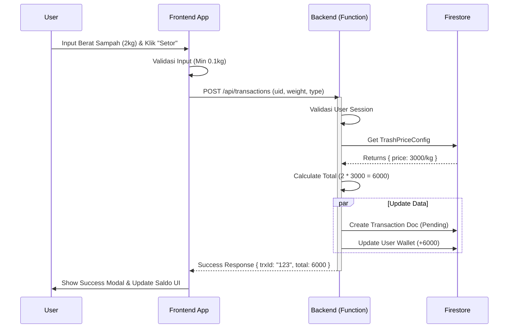

Dokumen teks seperti PRD itu penting, tapi manusia adalah makhluk visual. Seringkali, developer (dan stakeholder) tersesat dalam detail teks dan kehilangan gambaran besar bagaimana data mengalir antar komponen.

Menggambar diagram manual di Figma/Lucidchart memakan waktu. Di **Vibe Coding**, kita membiarkan AI yang "menggambar" untuk kita menggunakan kode.

## The Problem: The "Wall of Text"

Kamu punya PRD yang solid dan skema database yang rapi. Tapi saat mulai coding backend, kamu bingung:
*"Tunggu, saat user klik 'Bayar', apakah kita update saldo dulu baru simpan transaksi, atau sebaliknya? Kapan notifikasi dikirim?"*

Kebingungan alur (Flow Logic) adalah sumber bug logika terbesar.

## The Vibe Solution: Mermaid.js Generation

Kita tidak akan menggambar kotak dan panah satu per satu. Kita akan meminta Gemini untuk menulis kode **Mermaid.js**, sebuah sintaks markdown-like untuk membuat diagram.

### 🎯 The "System Architect" Prompt

Pastikan kamu sudah punya `PRD.md` dan `docs/db-schema.md` (dari bab sebelumnya) di workspace agar AI paham konteks penuh.

:::tip[Copy Prompt Ini]
**Context:** Lihat @PRD.md dan @docs/db-schema.md.
**Task:** Saya perlu memvisualisasikan alur fitur **[Nama Fitur, misal: Transaksi Setor Sampah]**.

Buatkan diagram **Sequence Diagram** menggunakan sintaks **Mermaid.js**.

**Requirements:**
1.  **Actors:** User, Frontend (Client), Backend (API/Cloud Functions), Firestore (Database).
2.  **Flow:** Mulai dari user menginput data -> validasi -> database operations -> response -> UI update.
3.  **Details:** Tunjukkan logic penting (misal: pengecekan saldo, update status).
4.  **Error Handling:** Tunjukkan jalur alternatif jika terjadi error (misal: koneksi putus).

**Output:** Hanya blok kode Mermaid.js.
:::

## Rendering Diagram

Setelah AI memberikan blok kode (biasanya diawali `sequenceDiagram`), kamu punya dua cara untuk melihatnya:

1.  **VS Code / IDX Extension:** Install ekstensi "Mermaid Preview" untuk melihat diagram langsung di editor.
2.  **Mermaid Live Editor:** Copy kode tersebut ke [mermaid.live](https://mermaid.live).

### Contoh Output AI (Mermaid Code)

*(Jika kamu menginstall plugin mermaid di dokumentasi ini, kode di atas akan otomatis me-render diagram interaktif).*

## Flowchart untuk Logika Bercabang

Selain Sequence Diagram (untuk urutan waktu), gunakan **Flowchart** untuk logika keputusan yang rumit.

:::tip[Prompt Flowchart]
"Buatkan **Flowchart** (Mermaid.js) untuk logika penentuan 'Level User' berdasarkan total sampah yang disetor. Ada kondisi: Bronze (<10kg), Silver (10-50kg), Gold (>50kg). Sertakan kondisi edge case."
:::

## Implementation: The "Blueprints" Folder

Jangan biarkan diagram ini hilang.

1.  Buat folder `docs/diagrams/`.
2.  Simpan output AI ke file `.md` (misal: `docs/diagrams/transaction-flow.md`).
3.  Gunakan previewer untuk selalu mengecek alur sebelum menulis baris kode pertama.

> **Why this matters:** Dengan diagram ini, kamu tidak perlu "menebak-nebak" logika saat coding nanti. Kamu tinggal menerjemahkan panah-panah di diagram menjadi fungsi JavaScript/TypeScript.
