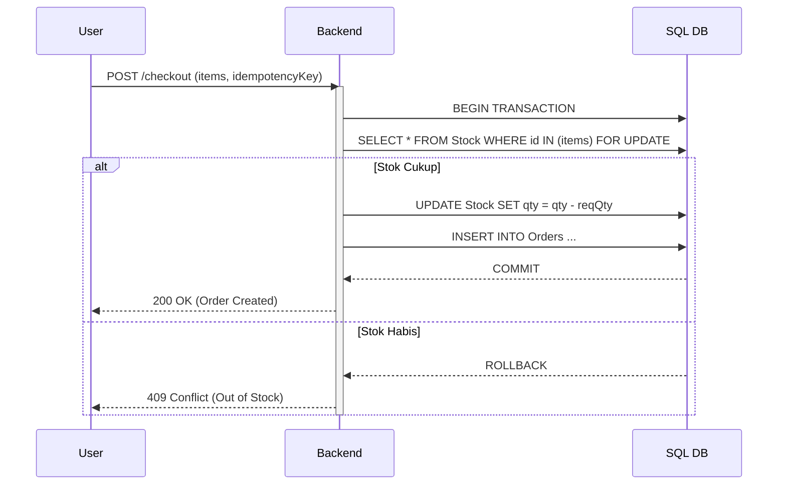

Dokumen teks seperti PRD itu penting, tapi manusia adalah makhluk visual. Seringkali, developer tersesat dalam detail teks dan kehilangan gambaran besar ("Big Picture").

Menggambar diagram manual di Figma/Lucidchart memakan waktu. Di **Vibe Coding**, kita membiarkan AI yang merancang logika aliran data, lalu memvisualisasikannya secara instan.

## The Problem: Logic Gaps

Seringkali PRD terlihat bagus di atas kertas, tapi hancur saat implementasi.
*"Tunggu, jika user offline saat checkout, lalu online lagi, apakah transaksinya duplikat?"*

Celah logika (*Logic Gaps*) ini sulit dideteksi hanya dengan membaca teks.

## The Vibe Solution: Reasoning First, Drawing Later

Kita menggunakan **Gemini 3 Deep Think** untuk memvalidasi logika terlebih dahulu, baru kemudian memintanya menulis kode **Mermaid.js**.

### 🎯 The "Architectural Validation" Prompt

Pastikan `PRD.md` sudah ada di workspace.

:::tip[Copy Prompt Ini]
**Mode:** Deep Think
**Context:** Lihat @PRD.md.
**Task:** Rancang dan visualisasikan flow untuk fitur **[Nama Fitur, misal: Checkout Barang]**.

**Step 1: Reasoning (Deep Think)**
Pikirkan semua kemungkinan *race conditions* dan *edge cases*. (Misal: Stok habis saat pembayaran diproses). Jelaskan strategi penanganannya.

**Step 2: Visualization (Mermaid)**
Berdasarkan reasoning di atas, buatkan **Sequence Diagram** (Mermaid.js) yang mencakup:
1.  **Actors:** Client, Backend API, Database (PostgreSQL/Firestore), Payment Gateway.
2.  **Logic:** Tunjukkan *happy path* DAN *unhappy path* (error handling).
3.  **Detail:** Tampilkan nama fungsi/tabel yang relevan.
:::

## Rendering Diagram

Setelah AI memberikan blok kode Mermaid, gunakan ekstensi VS Code "Mermaid Preview" untuk melihatnya.

### Contoh Output (Deep Think Reasoning)

> *"Analisis: Ada risiko 'Double Spending' jika user menekan tombol bayar 2x saat koneksi lambat. Solusi: Kita harus menerapkan Idempotency Key di level API dan database transaction yang atomik."*

### Contoh Output (Mermaid Code)

## Flowchart untuk Keputusan Bisnis

Selain Sequence Diagram, gunakan Flowchart untuk memetakan aturan bisnis yang kompleks.

:::tip[Prompt Flowchart]
"Buatkan Flowchart untuk logika 'Fraud Detection' saat user baru mendaftar. Pikirkan parameter: IP address, device fingerprint, dan pola email."
:::

> **Why this matters:** Diagram yang dihasilkan bukan sekadar gambar cantik, tapi hasil dari simulasi logika mendalam yang dilakukan AI. Ini adalah "Blueprint" yang sudah teruji sebelum kamu menulis satu baris kode pun.
